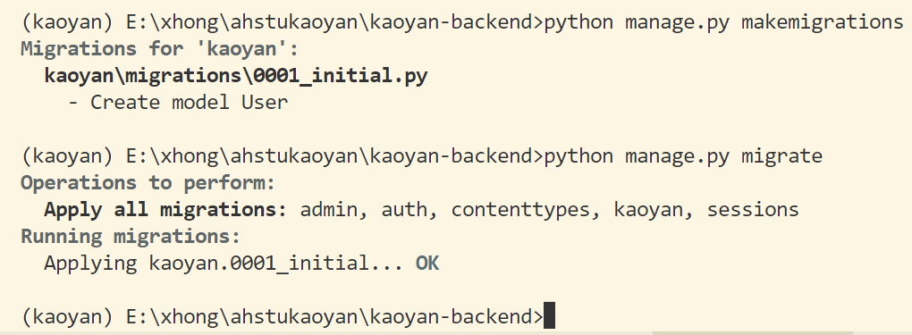

# 后端 Django 开发记录


## 一、创建项目

### 1 环境配置

#### 1.1 创建虚拟环境

```sh
conda create -n kaoyan python=3.9 -y
```

#### 1.2 激活环境

```sh
conda activate kaoyan
```

#### 1.3 安装 Django3.2

```sh
pip install django==3.2
```

#### 1.4 安装 Django Rest Framework

```sh
pip install djangorestframework
```

### 2 创建项目与应用

在激活的虚拟环境中使用 Django 创建项目

#### 2.1 创建项目

```sh
django-admin startproject ahstukaoyan
```

#### 2.2 创建应用

> 切换进项目目录

```sh
cd ahstukaoyan
```

> 创建名为 kaoyan 的应用

```sh
python manage.py startapp kaoyan
```

### 3 项目预配制

#### 3.1 注册应用

项目中每个创建的应用如需正常使用，都需要在 `settings.py` 中添加应用。

我们需要在 `settings.py` 文件中注册：

-  `rest_framework` 应用
- 上面注册的 `kaoyan` 应用

> 在 `INSTALLED_APPS` 中添加应用

```python
INSTALLED_APPS = [
    # ...
    'rest_framework',
    'kaoyan.apps.KaoyanConfig'
    # ...
]
```

#### 3.2 创建 `serializers.py` 文件

为了配合使用 django rest framework，我们在应用目录下创建 `serializers.py` 文件，用于定义输入 / 输出数据的序列化和反序列化方式。现在我们先不输入内容，后续再进行修改。

#### 3.3 连接 mysql 数据库

对 `settisng.py` 中的 `DATABASES` 项进行配置

```python
DATABASES = {
    'default': {
        'ENGINE': 'django.db.backends.mysql',
        'HOST': '127.0.0.1',    # 数据库主机
        "PORT" : "3306",    # 数据库端口
        "USER" : "*******",    # 数据库用户名
        "PASSWORD" : "******",   # 数据库用户密码
        "NAME" : "ahstukaoyan"  # 数据库名字
    }
}
```

与 `settisng.py` 同目录下的 `__init__.py` 内添加如下代码：

```python
import pymysql
pymysql.install_as_MySQLdb()
```

【注】：这里不写就无法正常连接 mysql 数据库。

#### 3.4 修改语言和时区

在 `settisng.py` 中，我们将系统默认的内容修改为中文 + 上海时间。

```python
LANGUAGE_CODE = 'zh-hans'
TIME_ZONE = 'Asia/Shanghai'
```

#### 3.5 收集项目依赖包信息

> 在虚拟环境中安装 `pipreqs`

```sh
pip install pipreqs
```

> 收集依赖包信息

使用 `pipreqs` 在指定目录下生成名为 `requirements.txt` 的文件，其内存放着本项目中所用到的所有依赖包的版本信息。

> 收集本项目依赖包版本信息

```sh
pipreqs ./ --encoding=utf-8 --force
```

当项目在一个新的环境下运行时，直接执行以下命令，即可安装项目所需的依赖包。

```sh
pip install -r requirements.txt
```

到这里项目的预设配置我们已经完成，下面我们进行具体业务内容的开发。

## 二、登录功能

#### 1 创建数据模型

在 `models.py` 中定义一个名为 `User` 的模型，用于存储用户信息，包括三个属性：

- 用户名
- 用户密码
- 用户使用权限

```py
from django.db import models
class User(models.Model):
    username = models.CharField(max_length=100)
    password = models.CharField(max_length=100)
    permission = models.CharField(max_length=100)
```

#### 2 添加序列化器内容

在 `serializers.py` 中定义一个名为 `UserSerializer` 的序列化器，用于将 `User` 模型实例转换为 JSON 格式。

```python
from rest_framework import serializers
from kaoyan.models import User

class UserSerializer(serializers.ModelSerializer):
    class Meta:
        model = User
        fields = ['id', 'username', 'password', 'permission']
```

#### 3 创建视图

在 `views.py` 中定义一个名为 `UserLoginAPIView` 的 API 视图类，用于处理用户登录请求。

```python
from rest_framework.views import APIView
from rest_framework.response import Response
from rest_framework import status
from kaoyan.models import User
from kaoyan.serializers import UserSerializer

class UserLoginAPIView(APIView):
    def post(self, request, *args, **kwargs):
        # 获取用户提交的数据
        username = request.data.get('username')
        password = request.data.get('password')

        # 查找数据库中是否存在该用户
        try:
            user = User.objects.get(username=username, password=password)
        except User.DoesNotExist:
            return Response({'error': 'Invalid credentials'}, status=status.HTTP_401_UNAUTHORIZED)

        # 将用户数据序列化为 JSON 格式并返回
        serializer = UserSerializer(user)
        return Response(serializer.data)
```

#### 4 创建路由

在 `urls.py` 中添加一个名为 `login` 的 URL 路径，将其指向 `UserLoginAPIView` 视图类。

```py
from django.urls import path
from kaoyan.views import UserLoginAPIView

urlpatterns = [
    path('login/', UserLoginAPIView.as_view(), name='user-login'),
]
```

#### 5 迁移数据模型修改

在 Django 中，对数据模型进行修改后，我们需要进行数据迁移，将改动传递给已经连接好的 mysql 数据库。

> 创建迁移文件

```sh
python manage.py makemigrations
```

> 执行迁移

```python
python manage.py migrate
```




至此，用户登录功能的后端部分就实现了。当前端发送 POST 请求到 `http://127.0.0.1:8000/login/` 并传递用户名和密码参数时，后端会在数据库中查找是否存在该用户，如果存在则返回该用户的信息，否则返回错误信息。
