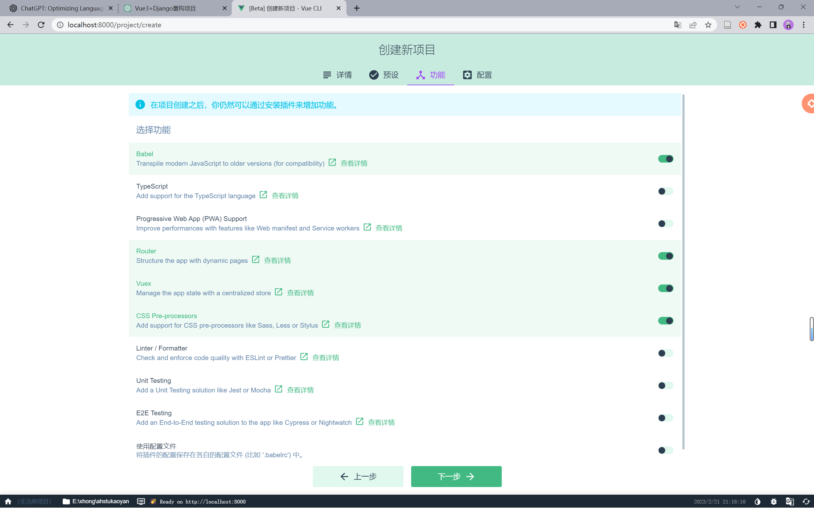
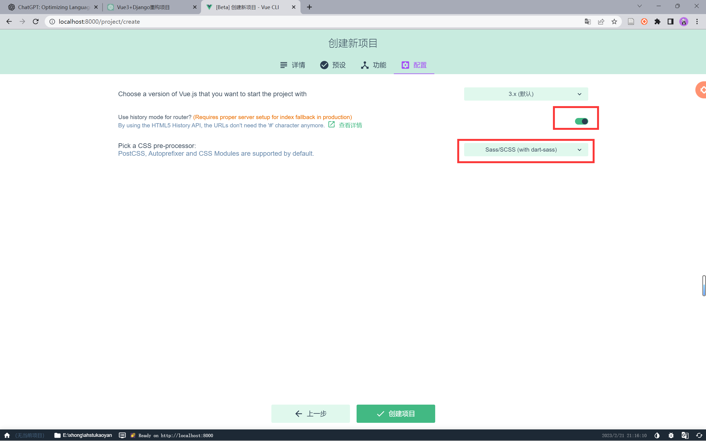

# 前端 Vue 开发记录


## 一、环境配置

### 1 安装 nodejs 最新版

### 2 使用 npm 全局安装 vue 脚手架

```sh
npm install -g @vue/cli
```

### 3 创建 Vue3 项目

> 在终端中输入，调用脚手架创建 vue 项目

```sh
vue ui
```

这里在选择功能，选择下图所示的四项内容



在后续配置中开启路由历史功能，并将css配置为scss开发模式



### 4 安装并配置 element-plus

> 使用 yarn 命令安装 element-plus

```sh
yarn add element-plus
```

> 修改全局配置

在安装 element-plus 后，需要进行全局配置，否则将无法正常显示样式，将 `main.js` 文件中代码修改为如下内容：

```js
import { createApp } from "vue";
import App from "./App.vue";
import router from "./router";
import store from "./store";
import ElementPlus from "element-plus";
import "element-plus/dist/index.css";

const app = createApp(App)
  .use(store)
  .use(router)
  .use(ElementPlus)
  .mount("#app");
```


## 二、登录界面

在项目根目录创建 api 文件夹，


## 三、cesiumJS

在 `main.js` 中引入，创建全局对象

- 使用cesium账户给予的官方密码
- 在 Access Tokens 里创建

在 vue 文件中创建 viewer 对象，全局对象

```vue
onMounted(async() = > {

})
```

